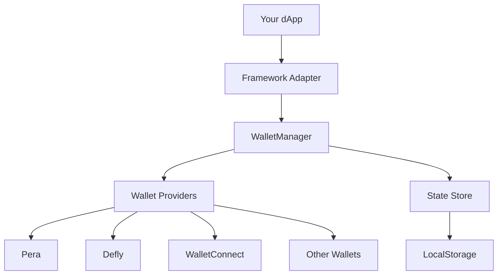

# Introduction to use-wallet

**@txnlab/use-wallet** is a powerful, framework-agnostic TypeScript library that simplifies Algorand wallet integration for decentralized applications. With reactive framework adapters and full TypeScript support, it provides a seamless developer experience across multiple platforms.

## Key features

<CardGroup cols={2}>
  <Card title="Modular wallet support" icon="wallet" iconType="duotone">
    Easily add or remove wallet providers with just a few lines of code. Configure each wallet as needed for your application.
  </Card>
  
  <Card title="Framework adapters" icon="layer-group" iconType="duotone">
    Built-in reactive adapters for React, Vue, SolidJS, and Svelte. Use the core library standalone or with your favorite framework.
  </Card>
  
  <Card title="Session persistence" icon="clock-rotate-left" iconType="duotone">
    Automatically restore wallet sessions for returning users with built-in state persistence.
  </Card>
  
  <Card title="Full TypeScript support" icon="code" iconType="duotone">
    Complete type safety with TypeScript definitions for all APIs, ensuring a robust development experience.
  </Card>
</CardGroup>

## Supported wallets

The library supports a wide range of Algorand wallet providers:

- **Pera Wallet** - Mobile and web wallet with deep linking support
- **Defly Wallet** - Native mobile and web browser extension
- **Exodus** - Multi-chain wallet with Algorand support
- **WalletConnect** - Protocol for connecting dApps to mobile wallets
- **Kibisis** - Browser extension wallet
- **Lute** - Web-based wallet solution
- **Magic** - Email-based wallet with passwordless authentication
- **Web3Auth** - Social login wallet integration
- **KMD** - Algorand Key Management Daemon for local development
- **Mnemonic** - Direct mnemonic phrase connection
- **Biatec** - WalletConnect-based wallet
- **Custom** - Build your own wallet integration

<Note>
Wallet provider packages are peer dependencies, so you only install what you need. This keeps your bundle size minimal.
</Note>

## How it works

The library is built on a clean architecture:

1. **Core library** (`@txnlab/use-wallet`) - Framework-agnostic wallet management using [@tanstack/store](https://tanstack.com/store)
2. **Framework adapters** - Reactive hooks/composables that subscribe to state changes
3. **Wallet implementations** - Each wallet provider extends a common `BaseWallet` class
4. **State persistence** - Automatic localStorage synchronization for session restoration



## Core capabilities

### Wallet management

- Connect and disconnect wallet providers
- Switch between active wallets and accounts
- Resume sessions automatically on page load
- Access wallet metadata and account information

### Transaction signing

```typescript
import { WalletManager } from '@txnlab/use-wallet'
import algosdk from 'algosdk'

// Sign transactions with active wallet
const signedTxns = await walletManager.signTransactions([txn1, txn2])

// Or use the TransactionSigner for AlgoSDK's AtomicTransactionComposer
const atc = new algosdk.AtomicTransactionComposer()
atc.addTransaction({ txn, signer: walletManager.transactionSigner })
```

### Network configuration

```typescript
import { WalletManager, NetworkId } from '@txnlab/use-wallet'

const walletManager = new WalletManager({
  wallets: [WalletId.PERA, WalletId.DEFLY],
  defaultNetwork: NetworkId.TESTNET
})

// Switch networks dynamically
await walletManager.setActiveNetwork(NetworkId.MAINNET)
```

## Get started

<CardGroup cols={2}>
  <Card title="Installation" icon="download" href="/installation">
    Install the library and optional wallet provider packages
  </Card>
  
  <Card title="Quick start" icon="rocket" href="/quickstart">
    Get up and running with a working wallet connection in minutes
  </Card>
</CardGroup>

## Framework-specific guides

<CardGroup cols={2}>
  <Card title="React" icon="react" iconType="solid">
    Use the `@txnlab/use-wallet-react` adapter with hooks
  </Card>
  
  <Card title="Vue" icon="vuejs" iconType="solid">
    Use the `@txnlab/use-wallet-vue` adapter with composables
  </Card>
  
  <Card title="SolidJS" icon="s" iconType="solid">
    Use the `@txnlab/use-wallet-solid` adapter with signals
  </Card>
  
  <Card title="Svelte" icon="s" iconType="solid">
    Use the `@txnlab/use-wallet-svelte` adapter with stores
  </Card>
</CardGroup>

## Community and support

- **GitHub**: [TxnLab/use-wallet](https://github.com/TxnLab/use-wallet)
- **npm**: [@txnlab/use-wallet](https://www.npmjs.com/package/@txnlab/use-wallet)
- **Sponsors**: [Become a sponsor](https://github.com/sponsors/TxnLab/)

<Note>
This library is maintained by [TxnLab](https://txnlab.dev) and open source contributors. We welcome issues, pull requests, and feedback!
</Note>